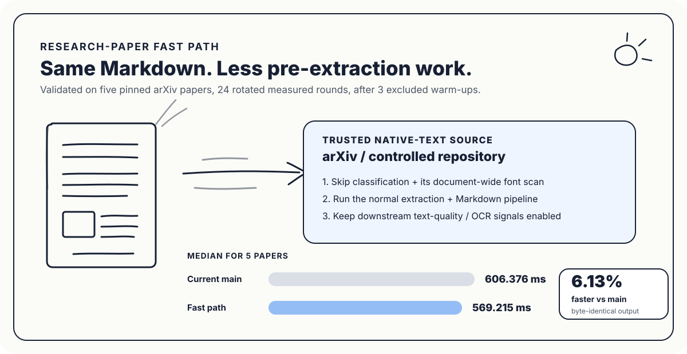

# pdf-inspector - Research Paper Fast Path

[](https://crates.io/crates/pdf-inspector)
[](https://www.npmjs.com/package/@firecrawl/pdf-inspector)
[](https://pypi.org/project/pdf-inspector/)
[](LICENSE)

This fork keeps the general-purpose `pdf-inspector` pipeline and adds an **opt-in fast path for caller-verified native-text research papers**. The primary target is research ingestion where the source is controlled - for example, PDFs fetched directly from arXiv - and the application already knows that a full pre-extraction classification pass is unnecessary.

The fast path skips redundant classification work while preserving the normal extraction, Markdown, layout, text-quality, encoding, and downstream OCR-signal checks.



> Upstream project: [firecrawl/pdf-inspector](https://github.com/firecrawl/pdf-inspector). This fork is focused on high-throughput research-paper ingestion and evaluation for Learnspace-style paper study and RAG workflows.

## Research-paper benchmark

The optimized path was evaluated against the untouched `main` implementation on a pinned five-paper arXiv corpus:

- `1706.03762v7` - *Attention Is All You Need*
- `1810.04805v2` - *BERT*
- `2005.14165v4` - *Language Models are Few-Shot Learners*
- `2010.11929v2` - *An Image is Worth 16x16 Words*
- `2006.11239v2` - *Denoising Diffusion Probabilistic Models*

The benchmark uses **3 excluded warm-up passes**, then **24 measured rounds** with rotating execution order to reduce cache, thermal, and ordering bias. Every measured path must produce the same Markdown signature before the performance result is accepted.

| Path | Median time / 5-paper corpus | Relative result |
|---|---:|---:|
| Untouched `main` | **606.376 ms** | baseline |
| Candidate, normal detector | **602.711 ms** | 0.60% faster than main |
| Research-paper fast path | **569.215 ms** | **6.13% faster than main** |

The committed fast path is also **5.56% faster than the same candidate using the ordinary detector**.

### Output-equivalence gate

Performance is not accepted by timing alone. The benchmark verifies byte-identical Markdown across the baseline, candidate default path, and research fast path. The validated run produced **479,680 Markdown bytes** with the same FNV-1a output signature across all paths.

The reproducible benchmark lives in [`research-fast-benchmark-v2.yml`](.github/workflows/research-fast-benchmark-v2.yml). It downloads the pinned papers, builds untouched `main` and the candidate independently, alternates measured runs, verifies output identity, and fails if the optimized implementation does not clear the configured improvement floor.

## What makes the fast path faster?

The default PDF pipeline needs to handle arbitrary documents. Before extraction it can classify pages and inspect document-wide font information so that scanned, mixed, image-based, and malformed PDFs are routed correctly.

For a source-controlled native-text paper, that classification work can duplicate information the extraction pipeline will analyze immediately afterward.

The research-paper path therefore changes this:

```text
PDF
  -> classification / page sampling / detector font scan
  -> extraction
  -> Markdown + quality analysis
```

into this:

```text
Trusted native-text research PDF
  -> skip redundant pre-extraction classification
  -> normal extraction
  -> Markdown + layout + text-quality checks
```

The optimization is intentionally narrow. It does **not** replace or weaken the normal parser for unknown PDFs.

## New fast-path APIs

### Python

Build this fork locally with the Python bindings, then use:

```python
from pdf_inspector import process_research_pdf

result = process_research_pdf("paper.pdf")
markdown = result.markdown
```

If your ingestion service already has the downloaded PDF in memory, avoid another filesystem round trip:

```python
from pdf_inspector import process_research_pdf_bytes

with open("paper.pdf", "rb") as file:
    result = process_research_pdf_bytes(file.read())

markdown = result.markdown
```

### Rust

```rust
use pdf_inspector::process_research_pdf;

fn main() -> Result<(), Box<dyn std::error::Error>> {
    let result = process_research_pdf("paper.pdf")?;

    if let Some(markdown) = result.markdown {
        println!("{markdown}");
    }

    Ok(())
}
```

For in-memory ingestion:

```rust
use pdf_inspector::process_research_pdf_mem;

let bytes = std::fs::read("paper.pdf")?;
let result = process_research_pdf_mem(&bytes)?;
```

The lower-level equivalent is `PdfOptions::research_paper()`, which selects the trusted-text detection configuration while leaving the extraction pipeline intact.

## How to use the faster implementation in production

The most useful deployment pattern is **source-aware routing**. Do not make the fast path the unconditional parser for every upload. Choose it when the acquisition layer can establish a strong trust boundary.

### Recommended routing

```python
from pdf_inspector import process_pdf_bytes, process_research_pdf_bytes


def parse_for_ingestion(pdf_bytes: bytes, source: str):
    if source == "arxiv-direct":
        # The acquisition layer fetched a modern native-text paper from a
        # source we explicitly trust for this route.
        return process_research_pdf_bytes(pdf_bytes)

    # User uploads, unknown URLs, institutional mirrors, scans, and mixed PDFs
    # retain the full classification and OCR-routing behavior.
    return process_pdf_bytes(pdf_bytes)
```

A practical paper-ingestion service can therefore look like:

```text
arXiv URL / arXiv ID
        |
        v
trusted downloader
        |
        v
process_research_pdf_bytes()
        |
        v
structured Markdown
        |
        +--> section-aware chunking
        +--> embeddings / retrieval index
        +--> paper-grounded RAG
        +--> notes / highlights / study workspace
```

For an arbitrary uploaded PDF, route through `process_pdf_bytes()` instead. If the normal result reports pages requiring OCR or encoding problems, the application can send only the affected material to its OCR/fallback path.

### Where this helps most

The fast path is a good fit when a system:

- imports large numbers of known research PDFs from arXiv or another controlled native-text feed;
- creates Markdown before section-aware chunking and embeddings;
- builds paper-grounded RAG indexes where ingestion latency matters;
- processes papers asynchronously in a worker queue and wants higher throughput per worker;
- repeatedly reprocesses a trusted corpus during indexing, evaluation, or schema changes;
- already owns source metadata that can decide whether full classification is necessary.

The gain is especially useful at scale: a small per-document saving compounds across large research collections while preserving the same extracted Markdown in the validated corpus.

## When **not** to use the fast path

Use the standard parser for:

- arbitrary user uploads;
- scanned papers;
- image-only PDFs;
- mixed text/scan documents;
- old papers with uncertain encodings;
- PDFs fetched from unknown or inconsistent sources;
- workflows where the acquisition layer cannot guarantee a native-text trust boundary.

In those cases:

```python
import pdf_inspector

result = pdf_inspector.process_pdf("document.pdf")
```

The ordinary path retains classification into `TextBased`, `Scanned`, `ImageBased`, or `Mixed` and produces page-level OCR-routing information.

## Core capabilities retained from pdf-inspector

- **Text extraction** - position-aware extraction with font information and automatic multi-column reading order.
- **Markdown conversion** - headings, lists, code blocks, tables, bold/italic formatting, URLs, page breaks, and cleanup.
- **Table detection** - rectangle-based and heuristic table detection.
- **CID font support** - ToUnicode CMap decoding for Type0/Identity-H fonts and common encodings.
- **Multi-column layout** - automatic column detection, sequential reading order, and RTL support.
- **Encoding issue detection** - flags text that should fall back to OCR.
- **Single document load** - the PDF is parsed once and shared by processing stages.
- **Python, Node.js, Rust, and WebAssembly support** through the upstream project interfaces.

## Standard quick start

### Python

```bash
pip install maturin
maturin develop --release
```

```python
import pdf_inspector

result = pdf_inspector.process_pdf("document.pdf")
print(result.pdf_type)
print(result.markdown)
```

Python API reference: [`docs/python.md`](docs/python.md)

### Rust

```toml
[dependencies]
pdf-inspector = "1"
```

```rust
use pdf_inspector::process_pdf;

let result = process_pdf("document.pdf")?;
println!("Type: {:?}", result.pdf_type);
```

Rust API reference: [`docs/rust-api.md`](docs/rust-api.md)

### Node.js

```bash
npm install @firecrawl/pdf-inspector
```

```javascript
import { readFileSync } from 'fs';
import { processPdf } from '@firecrawl/pdf-inspector';

const result = processPdf(readFileSync('document.pdf'));
console.log(result.pdfType);
console.log(result.markdown);
```

Node API reference: [`napi/README.md`](napi/README.md)

### Browser WebAssembly

```bash
npm install @firecrawl/pdf-inspector-wasm
```

WebAssembly API reference: [`wasm/README.md`](wasm/README.md)

## Architecture

```text
General / unknown PDF
  |
  +--> detector ------------------------+
  |                                    |
  |      TextBased / Scanned / Mixed   |
  |                                    v
  +-------------------------------> extractor
                                      |
                                      +--> fonts / encodings
                                      +--> content streams
                                      +--> XObjects / links
                                      +--> reading order
                                      +--> tables
                                      +--> Markdown
                                      +--> quality + OCR signals

Trusted research-paper route
  |
  +--> research_paper() fast path
          |
          +--> extractor (same downstream pipeline)
```

The important design constraint is that **trust is decided by the caller**, not guessed by the fast path. That keeps the optimization explicit, testable, and easy to disable when source quality is uncertain.

## Benchmark discipline

Performance changes to the research-paper path should continue to follow the same rules:

1. compare against an untouched `main` worktree;
2. use the exact same pinned corpus for baseline and candidate;
3. warm before measuring;
4. rotate execution order;
5. report medians across repeated runs;
6. verify Markdown identity before accepting a speedup;
7. reject optimizations that improve timing by silently weakening extraction quality.

This makes future parser work measurable rather than intuition-driven.

## License and attribution

This repository is a fork of [Firecrawl's `pdf-inspector`](https://github.com/firecrawl/pdf-inspector) and retains the upstream MIT license.

[MIT](LICENSE)
